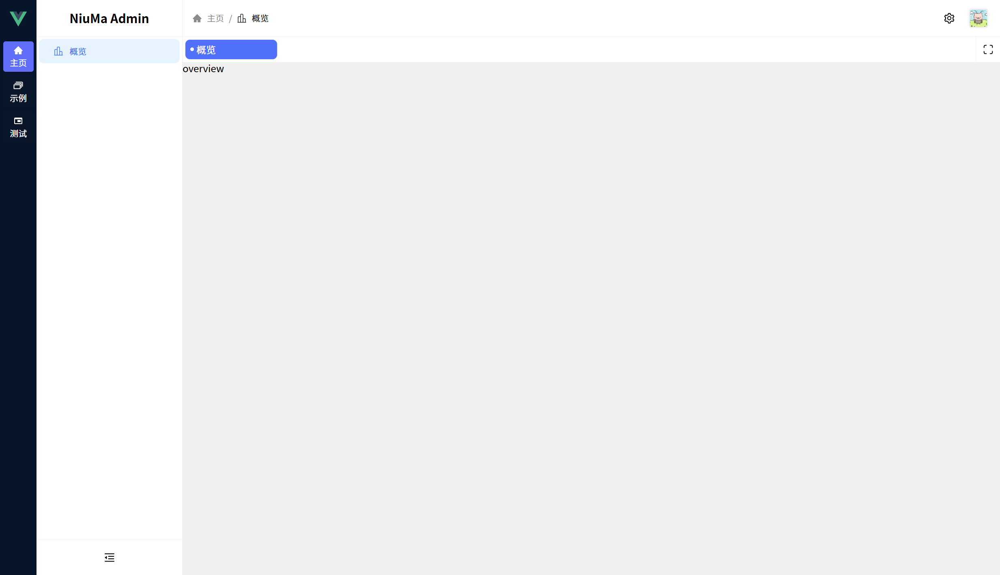

<div align="center">
  <h1>Niuma Admin</h1>
</div>

## 简介

Niuma Admin 是一个免费开源的中后台模板，它采用了 Vue3、Vite、JavaScript 等技术开发，开箱即用，适用于新手 vue 开发者和后端开发者，也适合学习参考。

## 预览

- [Niuma Admin](https://niuma-admin.salted-fish.top/) - 完整版中文站点

直接点击登录即可。




## 文档

[文档地址](https://niuma-admin-doc.salted-fish.top/)

## 脚手架创建

```bash
npm create niuma-admin@latest
```

## 克隆仓库使用

```bash
# 克隆仓库
git clone https://gitee.com/du-dudu/niuma-admin.git
# 进入目录
cd niuma-admin
# 安装依赖
npm install
# 运行
npm run dev
```

## 许可证

[MIT](./LICENSE)
